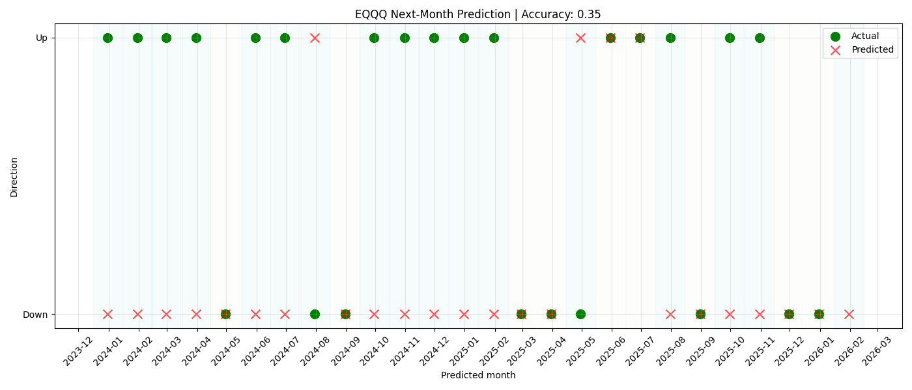

# Machine learning-based prediction of monthly market direction

## Introduction
The purpose is to investigate the possibility to use machine learning to predict the short-term direction (up or down) of an equity fund. The dataset used is historical monthly data for the *ETF EQQQ Nasdaq 100*. The model should predict whether the next month's closing price will be higher or lower than the current one.

## Step 1: Data Preparation

### Data Collection
The data was retrieved using the `yfinance` library. Daily prices and volumes from 2015 and onwards were downloaded. The data were aggregated to monthly data by taking the last closing price of each month and calculating the average monthly volume.

### Data Cleaning
During feature engineering, some missing values appeared at the beginning of the time series, mainly due to percentage change calculations `(pct_change)` and rolling averages over 3 and 6 months. These rows were removed using `dropna()`, leaving no remaining NaN values.

### Feature
To capture both trend and momentum, several numerical features were created, including:

- Monthly returns over 1 and 3 months
- Rolling averages of the closing price over 3 and 6 months
- Rolling average of volume over 3 months
- Current closing price and volume

The target variable `Up_Down` was defined as 1, if the next month’s closing price was higher than the current month, otherwise it was defined as 0.

## Step 2: Training the Machine Learning Model

**Model Choice**

Random Forest was selected as it can model nonlinear relationships and requires minimal preprocessing.

**Train-Test Split**

The dataset was split into training and testing sets using an *80/20 split*.

**Model Settings**

The Random Forest was trained with 200 trees `(n_estimators=200)` to make it reliable.

## Step 3: Model Evaluation

### Performance Metrics
Because this project solves a classification problem, I measured how well the model works using accuracy, precision, recall, and F1-score. The results show the model is better than guessing randomly, but its predictions are still limited, which is normal for financial data.

### Analysis
At first, the model often predicts “Down” for most months. This makes the F1-score for “Up” very low, even though it looks accurate okay. This shows that financial data has lots of randomness, and that having more “Down” months than “Up” months affects the model’s performance. Stock prices move up and down for many small, unpredictable reasons, like news, emotions, or events. Because of this, clear patterns are hard to see, and the model gets confused and often guesses wrong, even if it sometimes looks accurate overall. I believe that including indicators such as the *VIX* could potentially improve predictions. *VIX* measures market fear and uncertainty. When VIX is high, markets often fall or move more sharply. Adding *VIX* can give the model extra context about risk and stress, which may improve predictions, especially for down months.

Additionally, it would have been interesting to explore predictions based on the monthly median price rather than the last day’s closing price, as this might better reflect typical monthly performance.